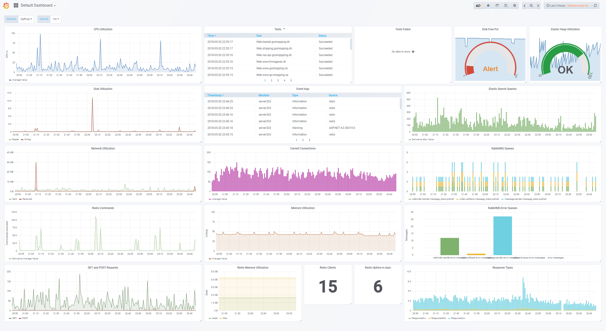

# Pinger
Small project containing two parts: a client installed on the server we need to test and get metrics about, and a windows service server installed on a central server that contains ElasticSearch, Kibana and/or Grafana for visualization.

## Motivation
Basically I needed some pretty simple metric about how the server acted, and I needed it without paying a high price in the sense of money. A lot of the good tools offer a lot of functionality that I don't need or use, so instead of buying a took to get my metric, I build a lightweight client.

## Configuration
The big part of this is the client. The client reads two configuration files:
1. General configuration file defining central aspects of the execution of the pinger program
2. Connection configuration file that contains the different metrics and tests the program have to execute on the server it is installed on

### General configuration file
```json
{
  "Logging.MinimumLevel": "Debug",
  "Logging.File.MinimumLevel" :"Warning",
  "Logging.Console.MinimumLevel": "Verbose",
	
  "Logging.Elastic.MinimumLevel": "Debug",
  "Logging.Elastic.Url": "http://localhost:9200",
  "Logging.Elastic.IndexFormat": "customername_log_{0:yyyy.MM}",
	
  "Logging.Slack.MinimumLevel": "Error",
  "Logging.Slack.Url": "",
	
  "Logging.Sentry.Dsn": "",
	
  "Logging.CoolSms.Key": "",
  "Logging.CoolSms.FromName": "",
  "Logging.CoolSms.Phonenumbers": "",
	
  "MPE.Pinger.Configuration.Path": "./Configuration/connections.json",
  "MPE.Pinger.Fail1.Pause.Secs": "5",
  "MPE.Pinger.Fail2.Pause.Secs": "60",
  "MPE.Pinger.Fail3.Pause.Secs": "180",
  "MPE.Pinger.WaitBetweenTest.Secs": "30",
  "MPE.Pinger.Report.Inteval.Sec": "60",
  "MPE.Pinger.Metric.Inteval.Sec": "5",
  "MPE.Pinger.TimeSpan.From": "00:01",
  "MPE.Pinger.TimeSpan.To": "23:59",
  "MPE.Pinger.ApiKeys.Path": "keys.txt",
  "MPE.Pinger.Server.Host": "localhost",
  "MPE.Pinger.Server.Port": "8080",
  "MPE.Pinger.RetentionInDays": "5"
}
```

__Logging.*__  
Configuration to define the different way of logging. Normally used to define how it reports the failed alerts.

__MPE.Pinger.Configuration.Path__  
Path to the connections configuration file containing the tests and what metrics it needs to extract

__MPE.Pinger.Fail?.Pause.Secs__ 
How may seconds it needs to pause after the first, second or third failed test

__MPE.Pinger.WaitBetweenTest.Secs__  
How may seconds between the different test executions

__MPE.Pinger.Report.Inteval.Sec__  
How often it reports its metrics to the report server

__MPE.Pinger.Metric.Inteval.Sec__  
How often it gathers metrics

__MPE.Pinger.TimeSpan.From__  
Start time for alerting period in case of failed test

__MPE.Pinger.TimeSpan.To__  
End time for alerting period in case of failed test

__MPE.Pinger.ApiKeys.Path__  
Path to newline separated file containing valid API keys - used if the execution mode is "Server"

__MPE.Pinger.Server.Host__  
Host for the reporting server

__MPE.Pinger.RetentionInDays__  
How long it persist data in ElasticSearch

## Connections configuration file
This configuration file contains how it will gather the data and what tests it should execute while on the server. It also defines the naming for the different objects when persisted to storage, along with the report endpoint and api key.

```json
{
  "Host": "MpeLocal",
  "RestEndpoint": "http://localhost:8080",
  "ApiKey": "7dcb7c7a-8d9f-4b56-9ce0-52fa40085b35",
  "Metrics": [
    {
      "Alias": "CpuPct",
      "Category": "Processor",
      "Name": "% Processor Time",
      "Instance": "_Total"
    }
  ],
  "EventLogging": {
    "MinimumLevel": "Information",
    "Categories": [
      "Application",
      "System"
    ]
  },
  "Connections": [
    {
      "Alias": "Redis-Connect",
      "Target": "127.0.0.1",
      "Port": 6379,
      "Type": "Tcp"
    }
  ],
  "Redis": {
    "Host": "127.0.0.1",
    "Port": 6379,
    "Metrics": [
      "total_connections_received",
      "total_commands_processed",
      "expired_keys",
      "used_memory",
      "used_memory_peak",
      "connected_clients",
      "used_cpu_sys",
      "uptime_in_seconds",
      "uptime_in_days",
      "maxmemory"
    ]
  },
  "RabbitMQ": {
    "Host": "localhost",
    "Port": 15672,
    "Username": "guest",
    "Password": "guest",
    "Fields": [
      "messages_ready$",
      "messages_unacknowledged$",
      "messages$",
      "deliver$",
      "ack$",
      "publish$"
    ]
  },
  "ElasticSearch": {
    "Host": "89.221.166.59",
    "Port": 9200,
    "Fields": [
      "indices.search",
      "jvm.mem"
    ]
  },
  "HaProxy": {
    "Endpoint": "https://localhost:9000/haproxy_stats",
    "Username": "admin",
    "Password": "admin",
    "Fields": [
      "*.*.(?:hrsp_1xx|hrsp_2xx|hrsp_3xx|hrsp_4xx|hrsp_5xx)",
      "*.*.(?:hrsp_1xx|hrsp_2xx|hrsp_3xx|hrsp_4xx|hrsp_5xx)",
      "*.*.(?:hrsp_1xx|hrsp_2xx|hrsp_3xx|hrsp_4xx|hrsp_5xx)"
    ]
  }
}

```

## Visualization



## Debugs

### My cluster broke my ElasticSearch

So after some cluster went down at my hosting company I started to see that there were no more data being saved in Elastic. So i updated my server code including it to write debug notes when calling the elastic save REST endpoint. And i got the following back:

```json
{
	"error": {
		"root_cause": [{
				"type": "cluster_block_exception",
				"reason": "blocked by: [FORBIDDEN/12/index read-only / allow delete (api)];"
			}
		],
		"type": "cluster_block_exception",
		"reason": "blocked by: [FORBIDDEN/12/index read-only / allow delete (api)];"
	},
	"status": 403
}
```

So to fix this, please fire the following against elastic

    > curl -Method Put -H @{'Content-Type'='application/json'} http://localhost:9200/_all/_settings -Body '{"index.blocks.read_only_allow_delete": null}'

A new feature for this could be to respond correctly to the failing POST request to ElasticSearch REST endpoint