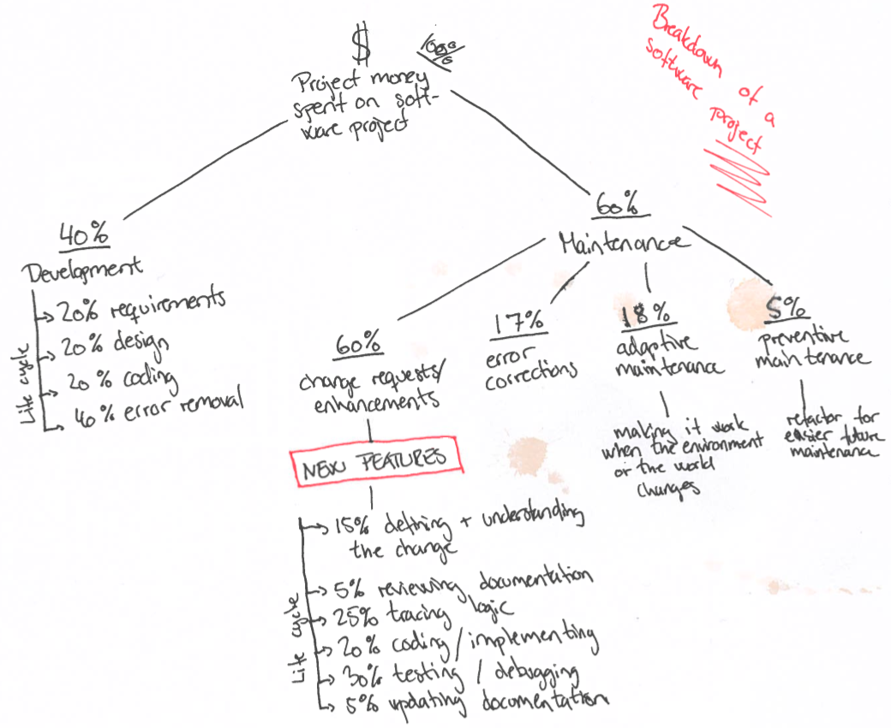

# Breakdown of a software project
This is a short summary of a concept described in the book "Facts and Fallacies of Software Engineering" by Robert L. Glass. This concept is about the breakdown of what the money from a software project have been spend on when the product is done (not that it ever will be done).

## Motivation
I have been a part of a project that have lasted for about six years, and still going strong. During that period of time I have had my ups and downs when it comes to motivation, and always told my self that it was because of the huge amount of maintenance, that a project like this produces. So a way to gain the motivation back I started to read about the lessons a developer can learn from other existing projects  - which lead me to read the "Facts and Fallacies of Software Engineering".

## Breakdown

So the breakdown is pretty simple. At the "end" of a software project, the customer have spend 100% of the money on the project. At the start you specify the project and develop the first version of it. This task takes around 40% of the money, subdivided in different stages of the development. 

But if you have 100%, removes the 40% then you have 60% back, but for what? This was not actually a surprise for me, because at that point in time, I had a lot of maintenance - so no news there. But the question is, what is maintenance? 

The author have a big amount of different sources that confirms this division of money spend. He stated that 60% of those 60% (therefor the 60/60 rule) is actually true development. Those 60% are used for change requests or what you can call system enhancements - stuff that we as developers actually get energy from doing. And that was actually what surprised me the most, more than half of the time we do maintenance, we actually enhance the system to be better than before. So i couldn't be irritated about doing maintenance, because most of the time I actually spend my time doing what I loved - development.

> Maintenance is 60% of the project - 60% of the maintenance is enhancement of the system - pure development

So what was it that actually irritated me about maintenance. Well, when you look at the drawing you can see that:

1. 18% of the maintenance is used on adaptive maintenance, this task is making small corrections to make it work event though the environment and surrounding world changes - that normally includes updates, cleanup of database records, and other manually boring tasks that just needed to be done.

2. 5% goes to preventive maintenance - basically a pretty word for refactoring, making the future easier for your self and your fellow developers on the team.

These two things are actually what I find extremely boring about maintenance, all the other stuff can be tricky or plain frustrating if its not chaotic system with no structures at all, but normally all the other stuff seems to be something that keeps my brain busy and productive. 

For example, look at the 17% error correction part of maintenance. This could be frustrating to find errors in someone elses code (and yes it's always someone else's code). The difference between boring and not is basically dependent on whether or not my brain gets challenged. By looking into a bug/error i force my brain to try to read and understand the logic of some other developer, and that task it self is pretty hard event for the best of debuggers.

> Boring depends on whether or not your brain gets challenged

So where lies the boring tasks about maintenance. For someone not liking the challenge that lies in understanding other developers set of mind it might be the distribution of time spend when doing enhancements to the system. 60% of maintenance are devoted to enhancement and new features. But out of those 60% enhancement, one uses:

* 15% on understanding the change or feature 
* 5% on reviewing the non-existing documentation
* 25% on tracking the existing logic
* 25% on actually implementing the change of feature
* 30% on testing and debugging the new code
* 5% on updating the non-existing documentation

So all of this contains about 55% of "fun" in the form of stages relating to normal non-maintenance-development of new features (implementing the change and testing it). A huge amount of time spend by the maintenance-developer is on understanding the system, the logic and ensuring that the new feature works in relation with the existing code-base - this task is very energy demanding and requires a very specific mindset. I personally think that is why a lot of developers don't enjoy making development in maintenance-stage systems. It basically requires too much understanding and not enough fun - even though you only use 45% on understanding the existing system.

## Conclusion
Be very careful when stating that you only want to do greenfield development (development on a new system without maintenance-stage components). This will limit you from doing work on 60% of existing systems currently running in production, and therefor limiting yourself to 40% of the work opportunities. What I concluded after reading this chapter and reflected on my own situation were:

> There are more fun tasks than dull and boring ones - you just have to create the right narative about your work.
> 
> Am I doing pointless stuff no-one will see or am I bringing value to the project and my customer?