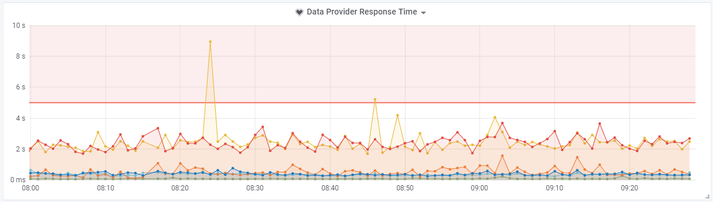

# The self service portal
This is just gonna be a short article that describes a pretty hectic part of my year, where I worked primary with a customer that needed a way to make their users able to see standard data, and later on interact with it.

## Motivation
The reason that I writes this is because I see it as important. Important that the technical guys actually shares their stories, and not just letting the managers and sales people define how it went through their point of view. This might not be a new innovative solution we came up with, but the process and discoveries were interesting to experience. 

Personally I really have to get better at writing these types of articles, that way I can gather the different solutions that I have been a part of. Because I did not do this alone - I'm just the person stupid enough to write my observations down.

## Background
The customer we had to develop a system for was a big fiber-connection company that needed to take the load off the service-desk personal. The main goal was to build a self-service environment were the customer could see their products, invoices, standard data and different codes for their products - may it be software or hardware. 

The goal here was to let 1000 customers in during 10 minutes when they e.g. send out all the newly generated invoices that should be paid by the customers.

## Spoiler alert
This is not a flaming article that only attacks the different roles in the story. It is minded on the learnings this project have thought the team, and hopefully my current employer. The resulting first fase of the system actually turned out to be a good and stable foundation for their future endeavors. 

## The formal process
This is normally the process where the entire team sits down and finds out how they want to run this project, agile, scrum, waterfall etc. But that should not be the case in this project. Before we, the technical guys, was introduced to the project the top management had already started to define the frames for the project. We choose to use a popular project management tool with good documentation capabilities with a good strong connection to the cases that would be created during the development of the system. Likewise the top management had been sold that the agile label was the new way to do stable and flexible software development so they got a contract for a Product Owner as well.

Normally you would say that all these things were great. Good tools, a method of developing software that can change direction from one day to the next - personally i am actually a fan of these things, but not in this context. 

The issue is that the company I was working for had been using a fairly old project management tool that all developers were pretty comfortable with. Fair enough, it was not the most graphical top-nutch tool, but it got the job done, and the project managers could generate what ever reports they needed without the big problems. By telling the customer that we were gonna use a new system with out asking the developers, or worst of all, not asking the assigned project manager, was pretty much a stab in the back for the team. We were without budget to learn the new project management tool, and the customer were already started to fill it with userstory data and documentation regarding all sort of business related stuff that might be useful in the future. 

The team had nothing to say - and the project were already behind schedule because of these decisions.

__Take-away:__ Ask the team before saying anything to the customer regarding tooling. And if you choose not to, please do estimate some time so the team can learn to use your chosen tool.

But any way, what was done was done and we had nothing to say about it as a team. Which leads me to the next small thing that got to be a even bigger issue than the forced tooling. In the world of software development there are a lot of ways to do agile development. You can go all the way with all the tools, meetings, roles in the team etc. which can be great - or you can try to use concepts like userstories and product owner for a start. At some point the latter were chosen for the team (that at this point were not even defined). The issue is not that there only were chosen a few concepts to work with, the issue were that the people taking the decisions had no idea of the responsibilities a product owner had, and had not read up on what a userstory should contain to be properly groomed.

At this point we were forced to use a project management tool no one had experienced with, and in that tool were userstories that were not groomed properly by the product owner, that did not know his responsibilities - and by the way avoided any responsibilities at all.

__Side note:__ Don't sell a Product Owner skillset you don't know if the person have - it ruins a lot fo the ones who have to pick up the pieces.

So lets get started with this already awesome project.

## Technicians entered the project
Finally the team was assembled. Three frontend developers of different skillset, two backenders, a designer, a project manager and off-cause the product owner (PO). We read through the documentation the customer had written and saw the different userstories that had been made. At this point we questioned the missing details regarding the userstories, because there we e.g. missing acceptance criteria, so in theory we did not know when the userstory were solved. But we took the word of the PO that this would get finalized soon enough.

__Take-away:__ Don´t expect that people actually do groom the stories - do follow up on it yourself.

We got through our first sprint-ish meeting and the project manager started to define what should be solved through the use of his new tool. So at this point the designer and frontend developers started to do their thing: a pretty simple MVC website with asynchronous content loaded from different API endpoints. At least that was what I were told the customer had bought, and what the architect had told me was the agreement at a separate meeting were we went through all the features and the infrastructure of the solution he had penned down in the project management tool (PMT)

So the picture of the setup are the following:

So I went on three weeks vacation during the summer with my mind at ease because all the developers knew where we were going with the project, and how it should take its form. And I could not be more wrong. That is one of the things vacation sucks at: maintaining control of the project. When me and my project manager got back from our needed vacation we were stunned with the direction the project were going.

All of a sudden we were developing a NodeJS application, currently based on some dummy API's using data contracts no backend developer had agreed upon. The only way to keep the web application running on production were by having a console window running on the remote desktop, and by the way, we had no way of deploying it. When I asked for the considerations regarding deployment, I were told that they thought it was okay to just copy paste the files from some random developers computer to the remote desktop enabled server. Three weeks had passed and the backend team I was a part of were currently set back two years, to the time of manually deploying artifacts because of some decisions made by some sales person, architect, frontend developer, or some other person that should have considered the question of skill and ability of deployment

__Take-away:__ Always ask yourself how you are gonna deploy your code before you chose some framework or other type of component.

### Infrastructure
We had some work to do as deployment- and operations-responsible. We were in a situations were more decisions had been taken without us being a part of it. But thats not a first in this project, so we just had to make do. The first thing we had to solve was the hosting and deployment issue of the NodeJS server. Because we were dealing with GDPR tricky data, we could not just use some external vendor that automatically boots the NodeJS application up and everything works, the customer needed control of the application. 

At this point in time we were already using TeamCity to build our code repositories and making Octopus deploy it to the target environments. So the idea were simple. Make the NodeJS application work on a Windows server so the customer do not have to buy a new server outside of the projects budget. After hours of research and frustrations a colleague of mine found a, some what, stable hosting and configuration setup that could be build, transformed and deployed through the current pipeline configuration. SUCCESS!!!

__Take-away:__ People that builds the components should be the ones running the ops part of it as well

At this point we were deploying four sites to a webserver, and three services to a  microservice(worker) server - it was a minimum viable setup, and still not even finished with fase one. Everything could be build and deployed in about eight minutes (add four more minutes and it could be on production as well).

Some of the frustrating things about working with new technology as NodeJS is that you do not have the skills and knowhow to know how it fits in with "normal" and planned infrastructure. An example could be that to limit the toil in the future I proposed to have a proxy in front of the servers to handle the SSL certificate. That way it would be terminated at the proxy level, and we should not do anything to our deployment pipeline and configuration. It worked for three out of four sites. Guess what site ruined that plan. 

The time were limited because the customer were doing UAT with the QA department and the entire infrastructure (as they saw it) were down. Another stab in the back by NodeJS. So we had to reverse the proxy idea and instead make the DNS point directly to the webserver and handle the toil of setting up bindings with new SSL certificates now and in the futures, along with reconfiguring the pipeline to choose the correct certificate at deployment. World is a happy place - that is when nothing changes, and no one takes a monkey out of his pocket and lets it loose in the datacenter (that would be NodeJS in this case).

__Take-away:__ Do have a QA setup that resembles the planned production setup. We were without a proxy server so we did not know the problems before it hit the customer in the face. Note to sales-personal: if you sell these projects, please sell the customers a proper QA and development environment as well.

### Integrations slow-down
So in parallel with all these fantastic challenges we also had to get some data from a provider. Not a fairly difficult thing to do, just call some API's and map it to a data model the website could use to display the data to the website-visitor. And the good part was that the architect had already agreed with the customer that all the API's that we had to use should only return the needed data in a readable and understandable format. In my mind I was already done with this case - it sounded so easy!

Well, theres also something called reality. First of all, make sure that all these so called agreements are in writing so you can actually judge the data foundation and say that it was not what we expected. I admit that my career is not that long, but the returned data from some of these API's were so long that it would fill seven to eight screens in my editor. The JSON were in 20 indented levels and the logic were not at all straight forward and understandable. It was a mess.

On top of that I did not entirely trust PostMan's calculated response time. It were about six seconds to get the needed product data (this were the most central piece of data needed for the portal)! I'm sorry, but WTF! By repeating my findings I had to do some documentations for the customer and the data provider - this were the start of a very long mail correspondence.

To do this I had to use some sort of tool to generate the graphs and manage the data. The choice were rather easy So i choose to use the small client (Pinger) I already had developed to survey other infrastructures. That way I just had to develop a small stop-watch client in the data provider integration, and make it post the data to the server for future visualization.

Below you can see the latest test executed. At the first couple of stages, and early in the mail correspondence these numbers were between two and seven seconds per API endpoint.

We tried to spread out the load to only load what were needed when the customer entered the site. The issue came if the customer had to access a deep link on the site, then the data would not be present, so we had to get as much data as possible to make sure that we did not have to call the data provider again and the visitor only experienced the site loading "slow" once, instead of being lacky all the time. 

To make sure that we actually have done something before going further with this issue, we went through our codebase and removed a bunch of unused code that both called the external data provider, but also stored a lot of data we did not use

__Take-away:__ Don't store data you don't know if you are gonna use. Wait and see.

After that we had to contact the customer and the external data provider - this were not good. At this point I had generated a 10 page performance and stress-test report so we had some data to use in the discussion. It contained both a baseline were we only used one data worker to get the data from the provider, along with a test with five, ten and twenty workers. The tendency were clear: no matter how many workers we booted, the response time at the data providers end just got longer, and we couldn't get more data faster - we just waited in line for our data.

Our analyzes defined pretty much what needed to be done. Either lower the response time on the different endpoints or change the server architecture. So the data provider developers started to dig into what might be wrong with the code, and sure thing they found some pieces of code that wasn't exactly optimized. Meaning that we went from six seconds to the around two second response time as shown in the graph. That is actually a pretty good optimization. At this point we had a long talk with our customer about what they actually expected we could manage, and how many visitors they thought the portal should be able to let in. The conclusion were somewhat chocking: "We need to be able to let 1000 visitors in over a period of 10 minutes". Translated to normal English, that would be 100 visitors per minute, ergo we had some work and discussions to do.

__Take-away:__ Test your external providers as early in the project as possible. That way you don't have to wait multiple weeks to get changes into their production environment. Lets call it a unofficial SLA/SLO with the provider.

So back to the our individual drawing boards. The question were if we, at our end, could optimize our worker, and perhaps guide the data provider on how we actually could achieve this. At our end we concluded that we couldn't do much more without compromising the existing requirements. The data provider suggested that we could add a proxy in front of four service tiers to perhaps quadruple the visitors per minute count. At the current setup we could let 30 visitors in and load their data from the data provider per minute. So if we could let four times that in per minute. One problem. This were a unforeseen expense for the customer on about $50.000 - lets just say I am glad not to be the developer telling the customer this. Tried it, its not funny to have to say that the customer have to pay an expense this high to actually achieve the wanted throughput. But again, if you want to get something you have to pay. This is still some unfinished business, but lets see in a couple of months when the data provider have released their changes to the production environment - so much for agile development and fast feedback loops.

### Monitoring and alerting
To monitor this we currently are using the small client called Pinger. The reason for this current choice is basically driven by some budget issues (no one wants to pay for monitoring of staging and QA setups, even though we need it when stress testing), and because it is fairly easy to setup and customize the visualization in Graphana. No one is saying that this is gonna be a production monitoring tool, but it was fast, easy, and didn't cost the customer anything.

The current components we are getting metrics from are:
* Server metric data (Microservice-, web-, and Middleware-servers)
* RabbitMQ
* Redis

On a more application near level we monitor:
* Response time on our own API's
* Response time on the integration towards our data-provider

The first of these two are one of the points were we setup some visualization to define how many requests actually failed with a InternalServerError compared with the overall amount of requests. That way we could have a primitive definition of a SLA and an error budget.

Along with that we executes tests to make sure that the different components actually works, or at least runs. On that level we test:
* Are the windows services (Redis, RabbitMQ and our own microservices) running
* Have the scheduled tasks been executed within X seconds
* Can we ping the endpoints and get a expected response back.
* Are our SSL certificate about to run out.

The debate here had to be regarding alert-ignorance. I had to define some alerts that would make sense, and make sure that it had to be alerts the ops-developer shouldn't ignore over time - they should act on it. With that in mind we are alerting on all the prior described tests and the following:
* Are Redis running out of memory?
* Are the data provider average response time over five sec?
* Do we return InternalServerError on our API? (avg of five over five min)
* Under 10% of disk space left?
* Over 80% of CPU utilization over the last 5 min.
* Over 80% of RAM utilization over the last 5 min.

The two latter cases are still something that I'm considering to remove from the alerting list. The reason for this considerations are the following quote:

> Are you service running as expected? If yes, what does it then matter if the host are running high om CPU or RAM?

I read it in a SRE book once and it sort of makes sense. Setup performance indicators based on throughput and then sort of ignore the host metrics. If the host is the limit it will reflect on the indicators you have defined.

When it comes to alerting, I experimented with the idea of a self-healing infrastructure. It sounds fancy but the flow is pretty straight forward, but might be discussed: 

1. The test fails e.g. a service is not running
2. Wait X seconds
3. Test again, it is still not running
4. Wait Y seconds
5. Test again, it is still not running
6. Wait Z seconds
7. Test again, it is still not running
8. Try to run a Powershell script e.g. Start-Service FooBar
9. Wait 30 secons
10. Test again, service are now running
    a. If it still not running, send the alert to the operations developer.

The idea here is, don't disturb the developer if you can build a automated monitoring system that tries to heal your infrastructure before requiring manual intervention.

### Now...

## Summary